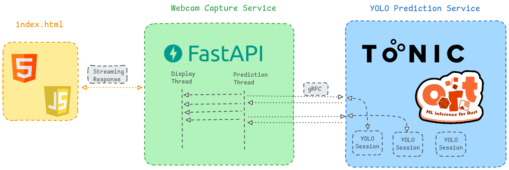

# YOLO Object Detection with Tonic and FastAPI

## 📝 Overview

This project implements real-time object detection using a YOLO model, a Rust gRPC service (Tonic + Ort)
for inference, and a FastAPI-based middleware that streams video from a webcam or file,
collects predictions, and serves them via an API.
A simple HTML page is available to visualize the detections live.

## 🛠️ Tech Stack

  - Rust ([Tonic], [Ort]) for running YOLO model inference via gRPC using [ONNX] runtime
  - [FastAPI] (Python) for handling video streaming and API requests
  - [OpenCV] for processing video frames in the middleware
  - HTML + JavaScript for real-time visualization

## 🏗️ Architecture



## ️📦 Installation

To run the project, simply execute the following command at the root directory:

```bash
make all
```

This will download the necessary images and automatically open a webpage for visualization.

## 🐧 OS Compatibility

Currently, the project only works on Linux as it relies on mounting the `/dev/video1` device.
If you are using a different video input, you may need to modify the source code accordingly.

<!--references-->
[ONNX]: https://onnx.ai/
[Tonic]: https://docs.rs/tonic/latest/tonic/
[Ort]: https://ort.pyke.io/
[FastAPI]: https://fastapi.tiangolo.com/
[OpenCV]: https://opencv.org/
