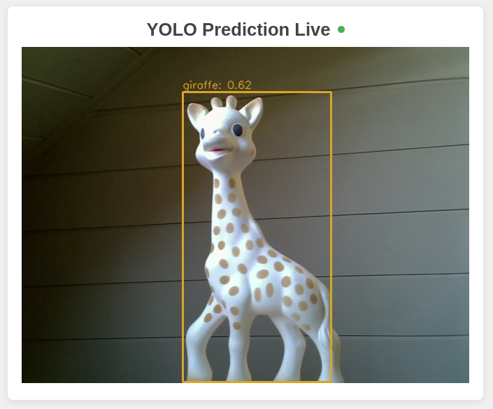
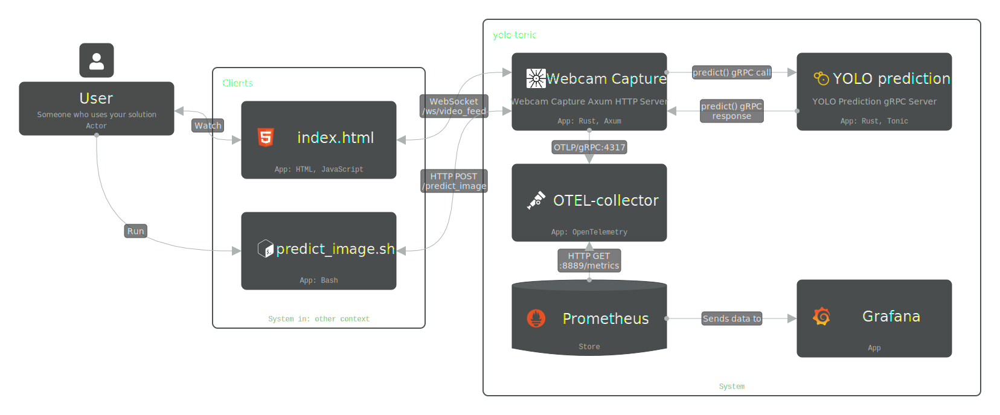

# YOLO Object Detection with Tonic and Axum

## 📝 Overview

This project implements a real-time object detection pipeline using a YOLO v8 model. A Rust-based gRPC service (using Tonic and Ort) handles inference, while an Axum-based middleware streams video from a webcam, collects predictions, and serves them via WebSocket. Additionally, a simple HTML page is provided for live visualization of the detections, and a predict_image POST endpoint allows direct inference on JPEG images.



## 🛠️ Tech Stack

  - [Tonic], [Ort] for running YOLO model inference via gRPC using [ONNX] runtime
  - [Axum], [Tonic] for handling video streaming and client Http requests
  - [OpenCV] for processing video frames in the middleware
  - HTML + JavaScript for real-time visualization

## 🏗️ Architecture



## ️📦 Installation

To run the project, simply execute the following command at the root directory:

```sh
make all
```

This will download the necessary images, runs the service and automatically
open a webpage for visualization.

## ⚡ Running with CUDA and TensorRT support

If you have [set up CUDA correctly](docs/setup/nvidia_docker.md), you can run the project with GPU acceleration by executing:

```sh
make all-trt
```

## ⏱️ Performances


The system is designed for real-time processing using parallel inference sessions to maximize throughput.

* **TensorRT**: The time taken to generate predictions for a single frame is typically around **40ms** (median) and **45ms** (99th percentile). This means the detections you see correspond to the video frame from approximately 40-45ms prior.

* **CPU**: The time taken to generate predictions for a single frame is typically around **72ms** (median) and **112ms** (99th percentile) with peaks at **140ms**. This means the detections you see correspond to the video frame from approximately 112ms prior.

This, of course, depends on the hardware you run and the results obtained here are on a RTX2060 with 8gb of VRAM and an AMD Ryzen 7 9800x3D.

## 🐧 OS Compatibility

Currently, the project only works on Linux as it relies on mounting the `/dev/video0` device.
If you are using a different video input, you may need to modify the source code accordingly.

## 📄 License

This project (the code in this repository) is licensed under the GNU AGPLv3, because it bundles and uses the YOLOv8m model, which is distributed under the AGPL-3.0 license.
Please refer to the [Ultralytics website for the YOLOv8m license](https://www.ultralytics.com/license).

This project is intended for educational and demonstration purposes. Users are responsible for ensuring compliance with the YOLOv8m model's license.

<!--references-->
[ONNX]: https://onnx.ai/
[Tonic]: https://docs.rs/tonic/latest/tonic/
[Axum]: https://docs.rs/axum/latest/axum/
[Ort]: https://ort.pyke.io/
[OpenCV]: https://opencv.org/
