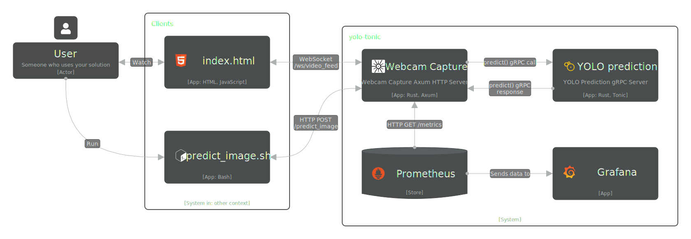

# YOLO Object Detection with Tonic and Axum

## 📝 Overview

This project implements a real-time object detection pipeline using a YOLO v8 model. A Rust-based gRPC service (using Tonic and Ort) handles inference, while an Axum-based middleware streams video from a webcam, collects predictions, and serves them via WebSocket. Additionally, a simple HTML page is provided for live visualization of the detections, and a predict_image POST endpoint allows direct inference on JPEG images.


## 🛠️ Tech Stack

  - [Tonic], [Ort] for running YOLO model inference via gRPC using [ONNX] runtime
  - [Axum], [Tonic] for handling video streaming and client Http requests
  - [OpenCV] for processing video frames in the middleware
  - HTML + JavaScript for real-time visualization

## 🏗️ Architecture



## ️📦 Installation

To run the project, simply execute the following command at the root directory:

```sh
make all
```

This will download the necessary images, runs the service and automatically
open a webpage for visualization.

## Running with CUDA support

If you have [set up CUDA correctly](docs/setup/nvidia_docker.md), you can run the project with GPU acceleration by executing:

```sh
make all-cuda
```

## 🐧 OS Compatibility

Currently, the project only works on Linux as it relies on mounting the `/dev/video1` device.
If you are using a different video input, you may need to modify the source code accordingly.

## 📄 License

This project utilizes the YOLOv8m model, which is distributed under the AGPL-3.0 license.
Please refer to the [Ultralytics website for the full license details](https://www.ultralytics.com/license).

This project is intended for educational and demonstration purposes.
Its licensing is subject to the licensing terms of the YOLOv8m model.

Disclaimer: Users are responsible for ensuring their compliance with the YOLOv8m model's license.

<!--references-->
[ONNX]: https://onnx.ai/
[Tonic]: https://docs.rs/tonic/latest/tonic/
[Axum]: https://docs.rs/axum/latest/axum/
[Ort]: https://ort.pyke.io/
[OpenCV]: https://opencv.org/
